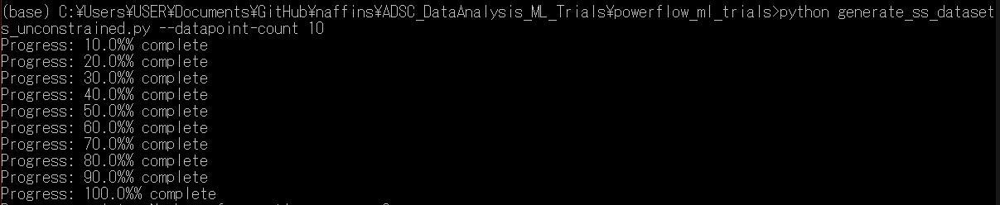

# datasets: Folder for synthetic generation of training and testing datasets

## Directory structure

- Testing: Folder containing testing datasets .csv files (attack.csv, special.csv, unconstrained.csv)
- Training: Folder containing training datasets .csv files (contrained.csv, ncombined.csv, unique_normal.csv, unor.csv)
- generate_ss_datasets_attack.py: script for attack testing dataset generator class (Generator_Attack)
- generate_ss_datasets_common.py: script for generator base class (Generator_Common)
- generate_ss_datasets_constrained.py: script for constrained dataset generator class (Generator_Constrained)
- generate_ss_datasets_ncombined.py: script for ncombined dataset generator class (Generator_NCombined)
- generate_ss_datasets_special.py: script for special dataset generator class (Generator_Special)
- generate_ss_datasets_unconstrained.py: script for unconstrained dataset generator class (Generator_Unconstrained)
- generate_ss_datasets_unique_normal.py: script for unique normal dataset generator class (Generator_Unique_Normal)
- generate_ss_datasets_unor.py: script for UNORdataset generator class (Generator_UNOR)
- network.p: File for pandapower network object representing grid. Generated by pandapower_net.py
- pandapower_log.log: Log file for pandapower scripts
- pandapower_mapping.py: File containing modbus unit number to pandapower network mappings as well as switch-to-CB number mappings
- pandapower_net.py: Script containing Pandapower_Net class for pandapower network creation and management
- pandapower_pf.py: Script containing Pandapower_PF class for power flow testing within ResiGate

## How to use

### Dataset generation

#### Common instructions for all generators

At the most basic level, type

    python generate_ss_datasets_unconstrained.py

Replace "generate_ss_datasets_unconstrained.py" with other script names as appropriate.

By default, this generates dataset with 20000 points and saves it as the file generated_ss_dataset.csv.

In some cases, you may wish to change the number of points generated and/or the output file, for which you may wish to use arguments. To see all available arguments for a generator, type
    python generate_ss_datasets_unconstrained.py --help

During generation, you will see progress updates for every 10% of the dataset that is completed.

At the end of generation, you will also see a completion message which reports the number of datapoints generated, number of anomalous datapoints generated, errors (if any) and time taken.

### Training Datasets

#### Constrained Dataset Generator (generate_ss_datasets_constrained.py)

For execution with default parameters, type

    python generate_ss_datasets_constrained.py

This generator also has the following flags:

- --output-file &lt;output file's name>: define output file name/location (default: ./generated_ss_dataset.csv)
- --datapoint-count &lt;number of datapoints to generate>: define number of datapoints to be generated (default: 20000)
- --switch-close-chance &lt;probability of switch closing>: define probability that an unconstrained load switch will be closed \[default: 0.5\] This flag is useful to alter the proportion of normal and anomalous datapoints generated. 

For example, to generate 10k datapoints with switch close chance being 0.7 and save them to output.csv type:

    python generate_ss_datasets_constrained.py --switch-close-chance 0.7

#### NCombined Dataset Generator (generate_ss_datasets_ncombined.py)

For execution with default parameters, type

    python generate_ss_datasets_ncombined.py

This generator also has the following flags:

- --output-file &lt;output file's name>: define output file name/location (default: ./generated_ss_dataset.csv)
- --datapoint-count &lt;number of datapoints to generate>: define number of datapoints to be generated (default: 20000)

For example, to generate 10k datapoints and save them to output.csv type:

    python generate_ss_datasets_ncombined.py --output-file ./output.csv --datapoint-count 10000

#### Unique Normal Dataset Generator (generate_ss_datasets_ncombined.py)

For execution with default parameters, type

    python generate_ss_datasets_unique_normal.py

This generator only has 1 flag:

- --output-file &lt;output file's name>: define output file name/location (default: ./generated_ss_dataset.csv)

Example of using the --output-file flag is shown in the previous generators.

#### Unique Normal Options Random (UNOR) Dataset Generator (generate_ss_datasets_unor.py)

For execution with default parameters, type

    python generate_ss_datasets_unor.py

This generator only has 1 flag:

- --output-file &lt;output file's name>: define output file name/location (default: ./generated_ss_dataset.csv)

Example of using the --output-file flag is shown in the previous generators.

### Testing Datasets

#### Unconstrained Dataset Generator (generate_ss_datasets_unconstrainted.py)

For execution with default parameters, type

    python generate_ss_datasets_unconstrained.py

This generator also has the following flags:

- --output-file &lt;output file's name>: define output file name/location (default: ./generated_ss_dataset.csv)
- --datapoint-count &lt;number of datapoints to generate>: define number of datapoints to be generated (default: 20000)

For example, to generate 10k datapoints and save them to output.csv type

    python generate_ss_datasets_unconstrained.py --output-file output.csv --datapoint-count 10000

#### Special Dataset Generator (generate_ss_datasets_special.py)

Other than the --output-file flag which is shared with the unconstrained generator, this generator features 2 other flags:

- --datapoint-count &lt;number of **normal** datapoints to generate>: define number of non-anomalous datapoints to generate \[default: 200\]
- --error-point-count &lt;max number of anomalous datapoints to generate per normal datapoint>: define maximum number of anomalous datapoints to generate per normal datapoint \[default: 5\]; note that it is not guaranteed that the generator always reaches this number, but at least 1 is guaranteed for each normal datapoint

Note that anomalous datapoints are always based on the normal datapoint immediately preceding it.

#### Attack Dataset Generator (generate_ss_datasets_unor.py)

For execution with default parameters, type

    python generate_ss_datasets_attack.py

This generator only has 1 flag:

- --output-file &lt;output file's name>: define output file name/location (default: ./generated_ss_dataset.csv)

Example of using the --output-file flag is shown in the previous generators.

